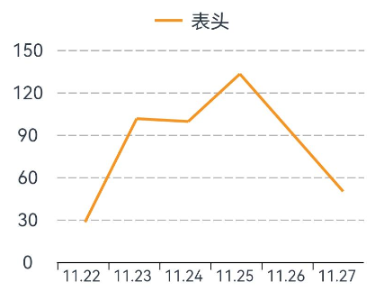

# 折线图组件说明

折线图组件开发整理--20231227

__折现图函数__，共5格，每格30.4像素，最低0点Y偏移149.最大值偏移-3

___

## 使用方式&可实现功能

### 包含内容
    4个文件

    VIEW中包含3个配置文件

    ZX_picture为直线折线界面文件(主要调用文件)


    

### 使用方式

```

import {zx_picture_jg} from '' 调用即可

```

### 实现功能

    接收后端发送数据实时数据更新,表格跳动

